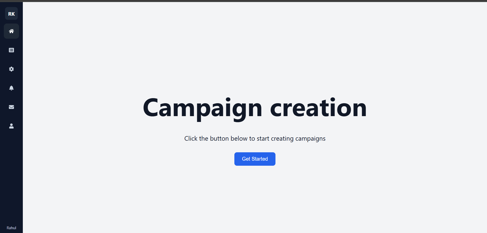
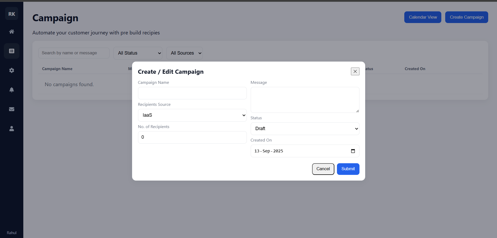
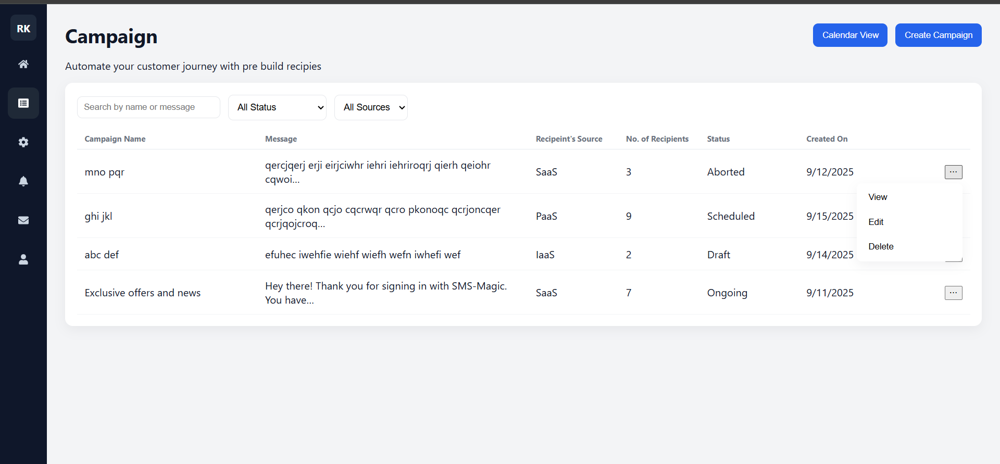
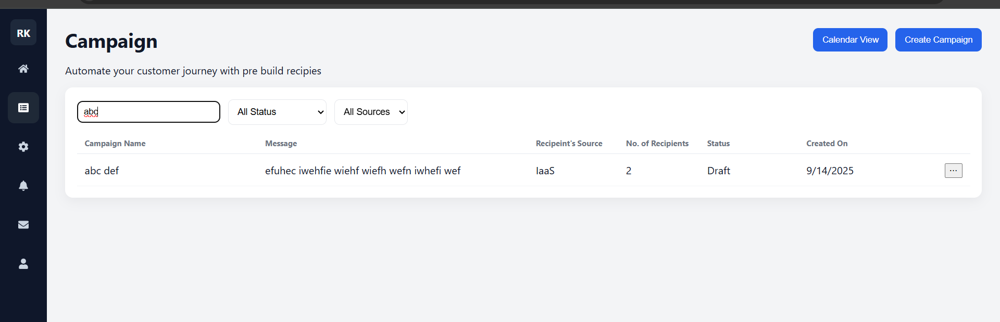
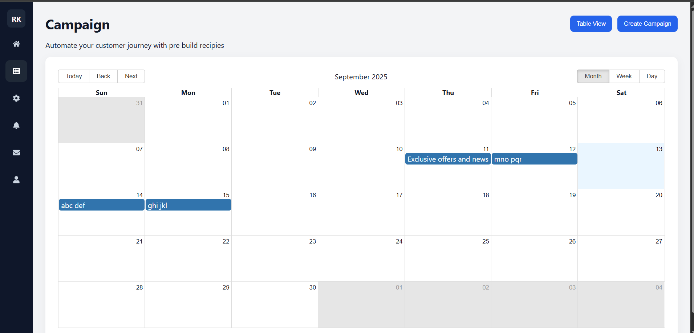
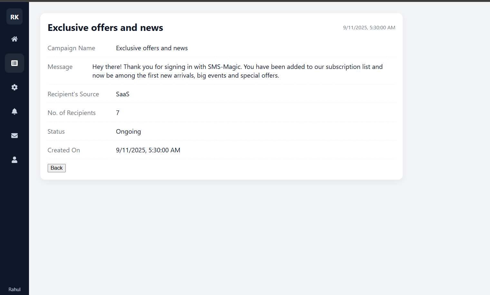

# Campaign Creation

A simple React + Vite web app to create, manage, and view marketing campaigns.
It supports table view and calendar view, with CRUD actions and local storage persistence.

## Features
- Landing page with project intro
- Sidebar navigation (Home, Campaigns, etc.)
- Campaign creation form (name, message, recipients, status, created on)
- Campaigns table with search, filter, edit, delete, view
- Calendar view (Month/Week/Day) for campaign scheduling
- Data stored in localStorage for persistence

## Landing Page and Sidebar navigation

## Campaign creation form

## Campaigns table with search, filter, edit, delete, view

## Calender View

## Campaign View
